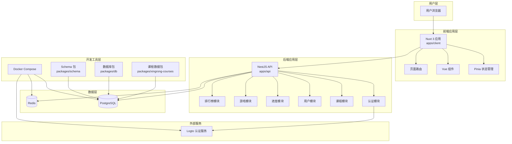
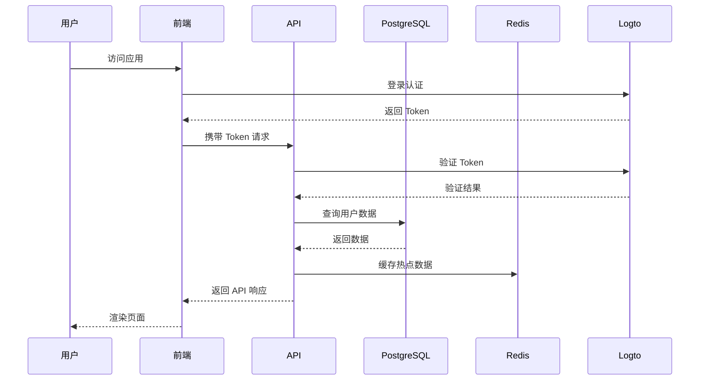
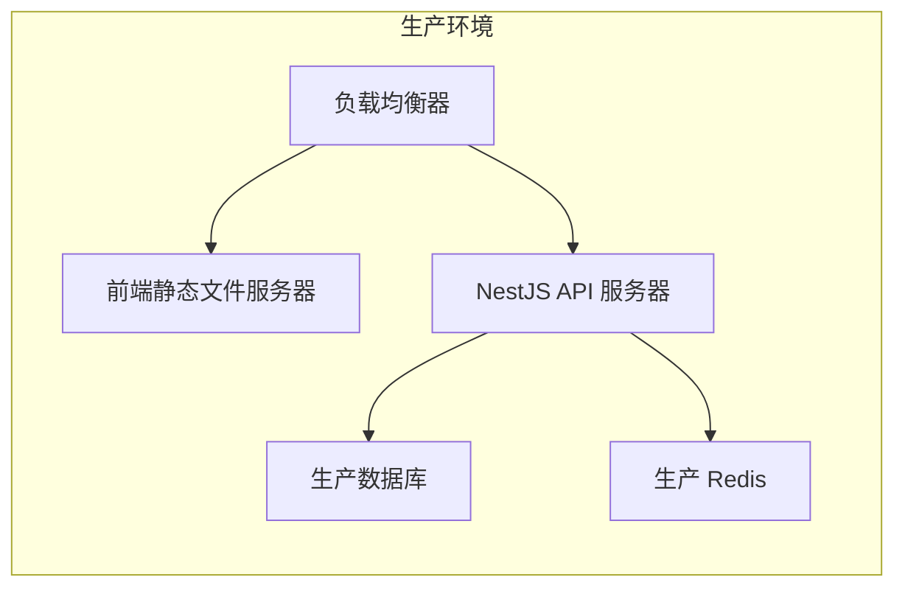

# Earthworm 项目架构文档

## 项目概述

**Earthworm** 是一个基于句子构建和连词的英语学习应用，采用现代 Web 技术栈构建的单体仓库项目。项目通过游戏化的方式帮助用户学习英语，支持多种学习模式和学习进度跟踪。

## 整体架构图

## 模块详细映射

### 🎯 前端应用 (`apps/client`)

| 模块           | 目录路径                         | 主要文件                          | 功能描述                  |
| -------------- | -------------------------------- | --------------------------------- | ------------------------- |
| **主应用**     | `apps/client/`                   | `app.vue`, `nuxt.config.ts`       | Nuxt 3 应用入口和全局配置 |
| **游戏页面**   | `apps/client/pages/game/`        | `[coursePackId]/[id].vue`         | 主要学习游戏界面          |
| **课程包页面** | `apps/client/pages/course-pack/` | `index.vue`, `[id].vue`           | 课程列表和详情页面        |
| **用户页面**   | `apps/client/pages/User/`        | `Setting.vue`                     | 用户设置和个人资料        |
| **状态管理**   | `apps/client/store/`             | `user.ts`, `course.ts`, `game.ts` | Pinia 状态管理            |
| **API 集成**   | `apps/client/api/`               | `index.ts`, `auth.ts`             | 后端 API 调用封装         |
| **组合式函数** | `apps/client/composables/`       | `useAuth.ts`, `useGame.ts`        | Vue 3 组合式 API          |
| **组件库**     | `apps/client/components/`        | `main/Game.vue`, `courses/`       | 可复用 UI 组件            |

### 🚀 后端应用 (`apps/api`)

| 模块           | 目录路径                               | 主要文件                                        | 功能描述                  |
| -------------- | -------------------------------------- | ----------------------------------------------- | ------------------------- |
| **应用入口**   | `apps/api/src/`                        | `main.ts`, `app.module.ts`                      | NestJS 应用启动和全局模块 |
| **用户管理**   | `apps/api/src/user/`                   | `user.service.ts`, `user.controller.ts`         | 用户认证、注册、个人信息  |
| **课程管理**   | `apps/api/src/course/`                 | `course.service.ts`, `course.controller.ts`     | 课程内容管理              |
| **课程包**     | `apps/api/src/course-pack/`            | `course-pack.service.ts`                        | 课程包组织和管理          |
| **学习进度**   | `apps/api/src/user-course-progress/`   | `user-course-progress.service.ts`               | 用户学习进度跟踪          |
| **学习活动**   | `apps/api/src/user-learning-activity/` | `user-learning-activity.service.ts`             | 学习活动记录和分析        |
| **排行榜**     | `apps/api/src/rank/`                   | `rank.service.ts`, `rank.controller.ts`         | 排行榜和游戏化功能        |
| **会员系统**   | `apps/api/src/membership/`             | `membership.service.ts`                         | 会员订阅和付费功能        |
| **已掌握元素** | `apps/api/src/mastered-element/`       | `mastered-element.service.ts`                   | 掌握的词汇和句子管理      |
| **历史记录**   | `apps/api/src/course-history/`         | `course-history.service.ts`                     | 学习历史数据              |
| **定时任务**   | `apps/api/src/cron-job/`               | `cron-job.service.ts`                           | 定时数据处理              |
| **工具模块**   | `apps/api/src/tool/`                   | `tool.controller.ts`                            | 实用工具接口              |
| **认证集成**   | `apps/api/src/logto/`                  | `logto.service.ts`                              | Logto 认证服务集成        |
| **全局模块**   | `apps/api/src/global/`                 | `db.provider.ts`, `global.module.ts`            | 数据库连接和全局配置      |
| **守卫**       | `apps/api/src/guards/`                 | `auth.guard.ts`, `course-packs-access.guard.ts` | API 访问控制              |

### 📦 共享包 (`packages/`)

| 包名             | 目录路径                     | 主要文件                            | 功能描述                   |
| ---------------- | ---------------------------- | ----------------------------------- | -------------------------- |
| **数据库模式**   | `packages/schema/`           | `src/schema.ts`, `package.json`     | Drizzle ORM 数据库模式定义 |
| **数据库工具**   | `packages/db/`               | `src/index.ts`, `src/migration/`    | 数据库连接和迁移管理       |
| **课程数据**     | `packages/xingrong-courses/` | `src/index.ts`, `src/pdf-parser.ts` | 课程数据处理和 PDF 解析    |
| **游戏数据 SDK** | `packages/game-data-sdk/`    | `src/index.ts`                      | 游戏数据工具包             |
| **文档**         | `packages/docs/`             | `index.md`, `package.json`          | VitePress 文档站点         |

## 数据流向图

## 核心技术栈

### 前端技术

- **框架**: Nuxt 3 (Vue 3)
- **状态管理**: Pinia
- **UI 框架**: Nuxt UI + Tailwind CSS
- **构建工具**: Vite
- **类型检查**: TypeScript

### 后端技术

- **框架**: NestJS (Node.js)
- **数据库**: PostgreSQL + Drizzle ORM
- **缓存**: Redis + ioredis
- **身份验证**: Logto
- **API 文档**: Swagger/OpenAPI

### 开发工具

- **包管理**: pnpm workspaces
- **代码质量**: ESLint + Prettier + Husky
- **容器化**: Docker Compose
- **测试**: Jest (后端) + Vitest (前端) + Cypress (E2E)

## 关键配置文件

| 文件路径                        | 用途              |
| ------------------------------- | ----------------- |
| `package.json`                  | 根项目配置和脚本  |
| `pnpm-workspace.yaml`           | pnpm 工作空间配置 |
| `docker-compose.yml`            | 开发环境容器配置  |
| `apps/api/src/main.ts`          | 后端应用入口      |
| `apps/client/nuxt.config.ts`    | 前端 Nuxt 配置    |
| `packages/schema/src/schema.ts` | 数据库模式定义    |

## 开发工作流

1. **环境启动**: `docker-compose up -d` 启动数据库和缓存
2. **数据库初始化**: `pnpm db:init` 创建表结构
3. **开发服务器**:
   - 后端: `pnpm dev:serve`
   - 前端: `pnpm dev:client`
4. **生产构建**:
   - 后端: `pnpm build:server`
   - 前端: `pnpm build:client`
5. **测试**: `pnpm test` 运行所有测试

## 部署架构

## 性能优化策略

1. **前端优化**

   - Nuxt 3 SSR/SSG 模式
   - 组件懒加载
   - 静态资源 CDN

2. **后端优化**

   - Redis 缓存热点数据
   - 数据库查询优化
   - API 响应压缩

3. **数据库优化**
   - 索引优化
   - 查询性能监控
   - 连接池管理

## 安全考虑

1. **身份验证**: Logto OAuth 2.0
2. **API 安全**: JWT Token 验证
3. **数据安全**: 输入验证、SQL 注入防护
4. **CORS 配置**: 跨域请求控制

---

本文档将随着项目的发展持续更新，确保架构信息的准确性和时效性。
